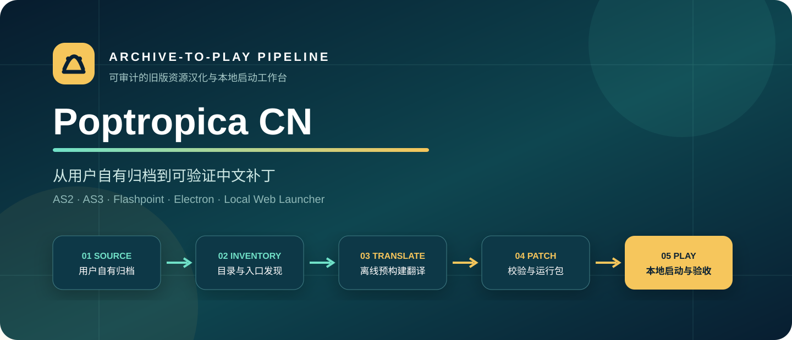
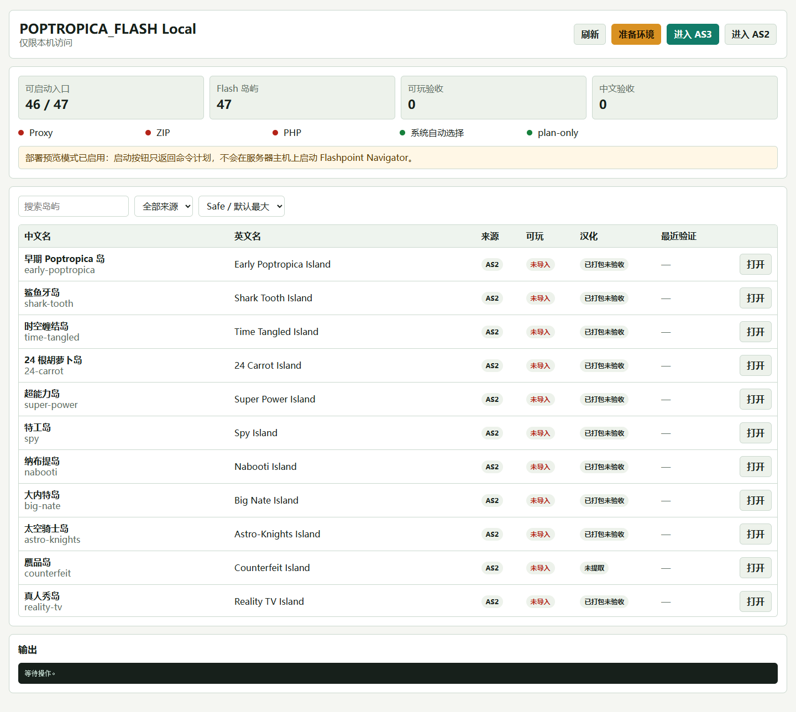
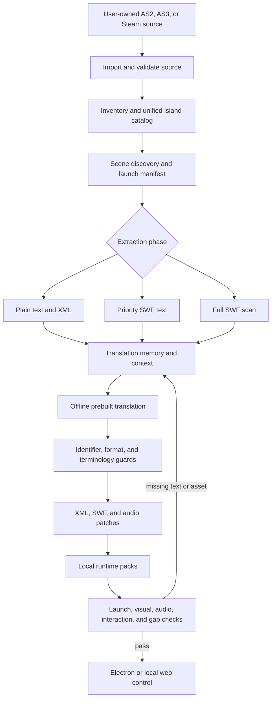
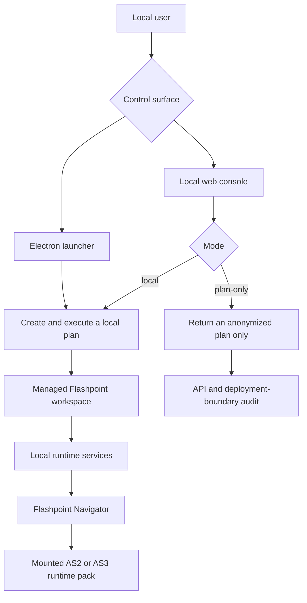

<div align="center">
  

# Poptropica CN

**Turn user-owned legacy Poptropica Flash archives into auditable, rebuildable, and testable Simplified Chinese runtime packs**

<sub>AS2 + AS3 · Managed Flashpoint runtime · Prebuilt localization · Electron and local web control surfaces</sub>


[简体中文](README.md) · [Capabilities](#2-capabilities) · [Preview](#3-interface-preview) · [Quick start](#11-quick-start) · [Validation](#16-validation-evidence)
</div>

<div align="center">
  <sub>Figure 1.1 — User-owned archives move through discovery, translation, patching, and validation before local playback</sub>
</div>

## 1 Project scope

Poptropica CN is a legacy Flash localization workbench that is separate from the current Haxe or Coolmath localization shell

It connects AS2 and AS3 source import, a unified island catalog, scene discovery, text extraction, prebuilt translation, patch generation, a managed Flashpoint runtime, and missing-translation review in one reproducible workflow [1]

The repository does not distribute original game archives, Steam installation content, or a Flashpoint data directory. Users must supply sources they are legally allowed to use

Public documentation excludes real deployment addresses, accounts, secrets, absolute machine paths, hardware models, and personal environment settings

## 2 Capabilities

<div align="center">

Table 2.1 — Implemented capabilities

| Area | Current implementation | Main entry point |
| --- | --- | --- |
| Source import | Flashpoint root, AS2 gamezip, AS3 gamezip, and optional Steam install | `tools/import-*.js` |
| Inventory | Coverage matrix, island catalog, and source status | `npm run inventory:sources` |
| Scene discovery | Unified launch manifest for AS2 and AS3 | `npm run discover:launch-scenes` |
| Extraction | `text-only`, `priority-swf`, and `full-swf` phases | `npm run extract:text` |
| Translation | Context batches, identifier guards, punctuation, and font constraints | `npm run translate:pack` |
| Patching | XML, SWF, audio, and runtime overlays | `npm run patch:pack` |
| Managed runtime | Prepared local Flashpoint workspace and required local components | `npm run bootstrap:flashpoint` |
| Desktop control | Electron launcher, refresh, prepare, and launch commands | `npm run launch` |
| Browser control | Local catalog, filters, launch plans, and no-spawn preview | `npm run web:launcher` |
| Audio fallback | Room, island, and global user-owned audio overrides | `runtime-data/user-audio/` |
| QA | Launch, IPC, window, audio, interaction, gap, and pack-input checks | `npm run qa:*` |
| Evidence | Manifests, provenance, reports, change log, and progress record | `catalog/`, `packs/`, `CHANGE.md`, `progress.md` |

</div>

The committed manifest snapshot contains 47 Flash island entries and 46 resolvable launch paths [1]

`reality-tv-wild-safari` remains incomplete because the available legal sources do not include an AS3 Shell with the required scene class

## 3 Interface preview

<div align="center">
  

Figure 3.1 — Real local browser console in plan-only mode, with no Flashpoint processes started
</div>

The browser console presents the catalog, AS2 and AS3 filters, environment preparation, and launch-plan actions

Modern browsers cannot execute NPAPI Flash directly. Flashpoint Navigator remains the playback host, while the web page acts as a control surface

## 4 Asset and legal boundary

<div align="center">

Table 4.1 — Repository and local-only content

| Content | Committed | Rationale |
| --- | --- | --- |
| Tools, launcher, catalog logic, and patch logic | Yes | Makes the engineering workflow auditable |
| Chinese patches, provenance, and hashes | When the source permits it | Records how a patch was produced |
| Original AS2 and AS3 archives | No | Supplied locally by an authorized user |
| Steam installation content | No | Read only from an explicitly selected local installation |
| Flashpoint runtime directory | No | Large, environment-specific local data |
| Translation database and runtime logs | No | May contain local paths and personal working state |
| User audio overrides | No | Source and authorization remain the user's responsibility |
| README media | Yes | Original artwork and anonymized real screenshots only |

</div>

Map metadata or a matching island identifier is not sufficient proof of playability. Resource, scene-class, and runtime evidence must agree [3]

## 5 End-to-end pipeline

<div align="center">



Figure 5.1 — Translation happens during the build; the default runtime does not call an online model

</div>

DeepSeek is used only for prebuild translation. The rules cover context, protected identifiers, punctuation spacing, and SimHei-compatible layout

## 6 AS2 and AS3 paths

<div align="center">

Table 6.1 — Differences between the two Flash generations

| Dimension | AS2 | AS3 |
| --- | --- | --- |
| Primary content | Legacy pages, XML, scene SWFs, and shared framework | Shell, scene packages, XML, SWFs, and asset trees |
| Entry discovery | Island identifier, room name, and legacy page parameters | Package name, scene class, and direct scene entry |
| Text writeback | Old SWF text format and font-ID compatibility | Asset presence plus Shell scene-class validation |
| Audio | Optional local fallback where sources are incomplete | Scene-reference and runtime-pack validation |
| Historical evidence | 34 entries with visual and scene evidence | 12 direct-scene entries validated; 1 Shell-class blocker remains |

</div>

Historical local QA covered 34 AS2 entries and 12 AS3 direct scenes across visual, scene, audio, or interaction matrices [3]

Those results belong to a specific authorized local source set. A clean clone intentionally does not contain those archives or runtime captures

## 7 Launch architecture

<div align="center">



Figure 7.1 — Electron and the browser control the workflow; the isolated local runtime hosts Flash content

</div>

The operating system selects a display by default. Tests or special layouts may opt into a generic display identifier through `POPTROPICA_QA_MONITOR`

AS3 safe maximize uses a bounded size because legacy NPAPI hosting can render white margins at native full-work-area dimensions

## 8 Browser and no-spawn modes

Local mode prepares the environment and may start Flashpoint Navigator for a requested runtime or island

No-spawn mode keeps the page, state API, and launch plans while preventing game processes from starting on the host. It is suitable for screenshots, API tests, and deployment-boundary previews

The console is designed for loopback access and must not be published directly to the internet

The README omits a fixed port and full local URL. The start command prints the address for the current process

## 9 Translation and patch protections

<div align="center">

Table 9.1 — Localization quality gates

| Gate | Method | Prevented failure |
| --- | --- | --- |
| Context | Group by source, asset, and adjacent text | One translation applied to unrelated meanings |
| Internal identifiers | Guard room names, classes, passwords, coordinates, and runtime fields | Broken scene loading or script logic |
| Text fragments | Protect split letters, formulas, and identifier-only fields | Meaningless Chinese or malformed objects |
| Fonts | Prefer compatible local CJK fonts with fallbacks | Missing glyphs or invisible Chinese text |
| Punctuation | Normalize game punctuation and spacing | Inconsistent bilingual layout |
| Coverage | Separate translatable, protected, missing, empty, and invalid rows | Misleading completion percentages |
| Writeback | Compare XML, SWF, and runtime replacement counts | Translation exists but never reaches the playable pack |

</div>

A historical full-source audit reached 100% coverage for rows classified as translatable. The local translation database is intentionally excluded from Git [3]

## 10 Audio overrides

AS2 sources may omit recoverable audio. The runtime checks a room-specific file, an island default, and a global default in that order

<div align="center">

Table 10.1 — Local audio precedence

| Priority | Relative location | Condition |
| --- | --- | --- |
| 1 | `runtime-data/user-audio/as2/<island>/<room>.<ext>` | A room-specific file exists |
| 2 | `runtime-data/user-audio/as2/<island>/default.<ext>` | No room-specific file exists |
| 3 | `runtime-data/user-audio/as2/_global/default.<ext>` | No island-specific file exists |
| 4 | Generated low-volume WAV | Keeps the audio path detectable when no user file exists |

</div>

Supported extensions are `mp3`, `ogg`, `wav`, and `m4a`. The entire directory is ignored by Git

## 11 Quick start

Requirements include Windows, Node.js, npm, Python, authorized AS2 or AS3 source files, Flashpoint, and JPEXS FFDec

Step one, install the locked dependencies

```powershell
# Install the committed dependency graph; ignoring scripts is sufficient for headless audits
npm ci --ignore-scripts
```

Step two, import user-owned sources with placeholders

```powershell
# Replace placeholders locally and never commit real machine paths
npm run import:flashpoint -- --flashpoint-root "<flashpoint-root>" --as2-gamezip "<as2-archive>" --as3-gamezip "<as3-archive>" --ffdec-cli "<ffdec-cli>"
```

Step three, prepare and diagnose the managed runtime

```powershell
# Prepare the workspace, discover launch scenes, and run environment diagnostics
npm run bootstrap:flashpoint
npm run discover:launch-scenes
npm run doctor:flashpoint
```

Step four, choose a control surface

```powershell
# Start the Electron control surface
npm run launch

# Or start the local web console; the terminal prints its local address
npm run web:launcher
```

Windows users may also run `Start-Poptropica-Flash.bat` or `Start-Poptropica-Flash.vbs` from the repository root

## 12 Localization workflow

Step one, inventory and discover entries

```powershell
# Rebuild the source inventory and launch manifest
npm run inventory:sources
npm run discover:launch-scenes
```

Step two, extract text from lower to higher risk

```powershell
# Extract plain text first, followed by priority SWFs
npm run extract:text -- --source as3 --phase text-only
npm run extract:text -- --source as3 --phase priority-swf
npm run extract:text -- --source as2 --phase priority-swf
```

Step three, translate and patch

```powershell
# Drain each source queue and build the local runtime patches
npm run translate:pack -- --source as3 --drain --limit 180
npm run translate:pack -- --source as2 --drain --limit 180
npm run patch:pack
```

Step four, launch one island or rebuild the recommended pipeline

```powershell
# Validate one public island identifier
npm run launch -- --island virus-hunter

# Rebuild with the current recommended workflow
npm run rebuild:pack
```

## 13 Repository layout

<div align="center">

Table 13.1 — Main paths and responsibilities

| Path | Responsibility | Privacy status |
| --- | --- | --- |
| `launcher/` | Electron main process, preload, and renderer | Public code |
| `tools/` | Import, extraction, translation, patching, launch, and QA | Public code |
| `catalog/` | Coverage, islands, and launch manifest | Anonymized snapshot only |
| `packs/zh-CN/as2/` | AS2 patches, reports, and provenance | No original archives |
| `packs/zh-CN/as3/` | AS3 patches, manifest, and provenance | No original archives |
| `runtime-data/` | Local config, database, workspace, logs, and captures | Git-ignored |
| `CHANGE.md` | Development change record | Machine identifiers removed |
| `progress.md` | Long-form implementation and QA evidence | Machine identifiers removed |

</div>

## 14 Command map

<div align="center">

Table 14.1 — Common commands

| Goal | Command | Notes |
| --- | --- | --- |
| Electron launcher | `npm run launch` | Opens the desktop control surface |
| Local web launcher | `npm run web:launcher` | May execute local launch plans |
| Safe deployment preview | `npm run web:launcher:no-spawn` | Returns plans without game processes |
| Diagnostics | `npm run doctor:flashpoint` | Checks local sources and components |
| Discovery | `npm run discover:launch-scenes` | Rebuilds the launch manifest |
| Extraction | `npm run extract:text` | Selects a source and extraction phase |
| Translation | `npm run translate:pack` | Produces prebuilt Chinese translations |
| Patching | `npm run patch:pack` | Writes XML, SWF, and runtime overlays |
| Pack verification | `npm run verify:pack-inputs` | Compares manifest and actual inputs |
| Web regression | `npm run qa:web-launcher` | Tests state, page, and plan APIs |
| IPC regression | `npm run qa:launcher-ipc` | Tests Electron launch contracts headlessly |
| Gap audit | `npm run qa:launch-gaps` | Explains unresolved launch entries |
| Goal evidence | `npm run qa:goal-evidence` | Aggregates completion gates and blockers |

</div>

## 15 Key artifacts

<div align="center">

Table 15.1 — Workflow artifacts and Git policy

| Artifact | Contents | Git policy |
| --- | --- | --- |
| `catalog/coverage-matrix.json` | Source coverage matrix | Generated and ignored by default |
| `catalog/islands.json` | Unified island catalog | Generated and ignored by default |
| `catalog/launch-manifest.json` | Scene entries and launchability | Anonymized snapshot committed |
| `runtime-data/text-index.sqlite` | Text index and translation memory | Ignored |
| `runtime-data/doctor-flashpoint.json` | Local environment diagnosis | Ignored |
| `runtime-data/workspaces/flashpoint-managed/` | Managed runtime workspace | Ignored |
| `runtime-data/misses.jsonl` | Runtime missing-translation records | Ignored |
| `packs/zh-CN/as2/` | AS2 patches and provenance | Allowlisted content committed |
| `packs/zh-CN/as3/` | AS3 patches and provenance | Allowlisted content committed |

</div>

## 16 Validation evidence

<div align="center">

Table 16.1 — Checks rerun for this README release

| Check | Result | Boundary |
| --- | --- | --- |
| Node.js and Python syntax | Passed | Modified launcher, web, QA, and runtime helpers |
| Clean dependency install | Passed | Lock file synchronized; `npm ci --ignore-scripts` is repeatable |
| Web launcher API | Passed | Health, state, AS3 plan, island plan, invalid input, and no-spawn |
| Electron IPC | Passed | 10 handlers, busy guard, safe sizing, environment restoration, and disabled direct launch |
| Runtime-pack inputs | Passed | 48 AS2 plus 47 AS3 inputs, 95 total |
| Real browser rendering | Passed | Original screenshot, 0 console errors and 0 warnings |
| Launch-manifest snapshot | 46 / 47 | Clean clones do not overwrite source-backed historical evidence |
| Dependency security audit | Open | Current installation reports 6 high and 4 moderate findings |

</div>

A clean clone without user archives correctly reports unresolved entries in a fresh gap audit. This environment result does not invalidate the committed, source-backed manifest snapshot

The full 47-island visible matrix was not rerun because the repository intentionally excludes original archives and user audio

## 17 Privacy and security

- Real disk paths, display models, screen coordinates, and local library locations were removed from defaults, manifest snapshots, and historical documents
- The operating system selects displays by default; automated tests use a neutral fixture name
- The web console is local-only, with no-spawn mode for remote-boundary previews
- Archives, user audio, databases, runtime workspaces, logs, and captures remain Git-ignored
- README screenshots contain no accounts, credentials, production domains, or private configuration
- Examples use angle-bracket placeholders instead of real paths

If a credential is ever detected, revoke and rotate it first, then clean Git history. Editing the latest README cannot remove a secret from previous commits

## 18 Known limitations

<div align="center">

Table 18.1 — Current limitations

| Limitation | Impact | Direction |
| --- | --- | --- |
| Wild Safari lacks its AS3 Shell scene class | 1 of 47 entries remains incomplete | Accept only verifiable, lawful code sources |
| Original archives are excluded | Clean clones cannot launch games or rerun the full visual matrix | Import locally and preserve source evidence |
| Native AS3 full-work-area maximize is unstable | May produce right or bottom white margins | Keep bounded safe sizing as the default |
| Full AS3 SWF writeback is expensive | A full FFDec pass may time out | Build a recoverable incremental path |
| Legacy dependencies have security findings | The app is unsuitable for direct public exposure | Upgrade in measured stages and keep local isolation |
| No root license file | Repository-wide redistribution terms are unclear | Add a reviewed license and third-party notices |

</div>

## 19 Roadmap

- [ ] Find a lawful `game.scenes.reality2` implementation or compatible Shell
- [ ] Build recoverable incremental AS3 SWF writeback
- [ ] Compress long historical reports into a machine-readable evidence index while retaining the originals
- [ ] Upgrade vulnerable legacy dependencies and add continuous security scanning
- [ ] Add a copyright-free minimum fixture for clean-clone tests
- [ ] Add a reviewed root license and third-party notices

## 20 Contributing

Contributions should identify source provenance, authorization boundaries, target islands, build commands, and validation evidence

Do not commit original game archives, personal runtime logs, absolute machine paths, accounts, tokens, server addresses, or unlicensed media

Player-visible strings and internal identifiers must be treated separately. Room names, class names, object keys, passwords, and coordinates must not be translated simply because they are readable

## 21 License and sources

`package.json` preserves upstream Flashpoint Launcher author and MIT metadata [5]. The repository root currently has no `LICENSE` or `COPYING` file, so that metadata is not sufficient to claim that the entire repository, Chinese patches, or third-party assets are MIT licensed

Poptropica names, game content, and original assets belong to their respective rights holders. Provenance JSON, hashes, and archive references support auditing but do not grant redistribution rights

## 22 References

[1] AIALRA-0, “Poptropica launch manifest,” `catalog/launch-manifest.json`, 2026

[2] AIALRA-0, “Chinese AS2 and AS3 pack manifests and provenance,” `packs/zh-CN/`, 2026

[3] AIALRA-0, “Poptropica localization progress and QA evidence,” `progress.md`, 2026

[4] AIALRA-0, “Poptropica localization change record,” `CHANGE.md`, 2026

[5] Flashpoint Project contributors, “Flashpoint Launcher package metadata,” `package.json`, version 14.0.3

[6] AIALRA-0, “Local launcher, translation, patching, and QA tools,” `tools/` and `launcher/`, 2026
