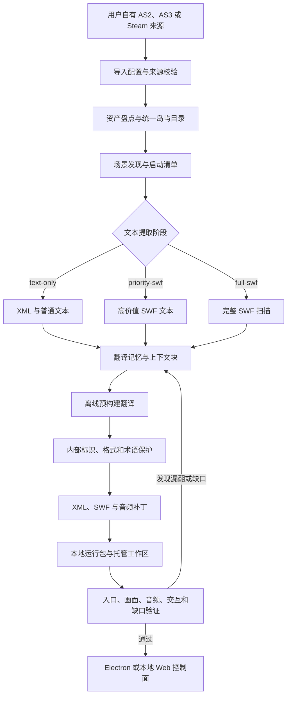
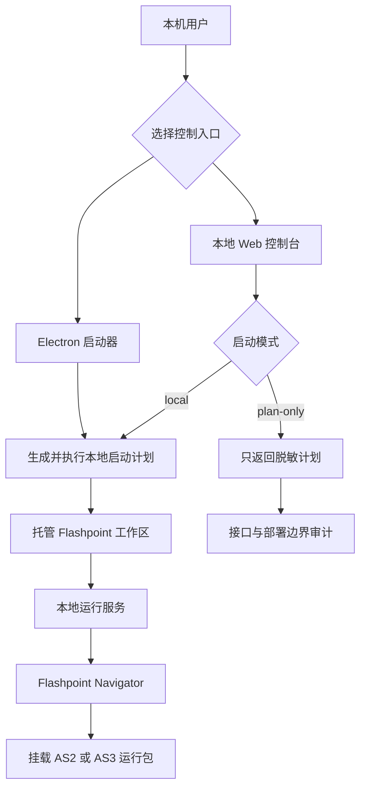

<div align="center">
  

# Poptropica CN

**把用户自有的旧版 Poptropica Flash 归档整理成可审计、可重建、可验证的中文本地运行包**

<sub>AS2 + AS3 · Flashpoint 托管运行时 · 预构建汉化 · Electron 与本地 Web 双入口</sub>


[English](README.en.md) · [能力矩阵](#2-当前能力) · [界面预览](#3-界面预览) · [快速开始](#12-快速开始) · [验证证据](#16-验证证据)
</div>

<div align="center">
  <sub>图 1.1　用户自有归档经过发现、翻译、补丁和验证后进入本地运行环境</sub>
</div>

## 1 项目定位

Poptropica CN 是一个独立于当前 Haxe 或 Coolmath 汉化壳的旧版 Poptropica Flash 本地化工作台

项目把 AS2 与 AS3 归档导入、统一岛屿目录、场景入口发现、文本提取、预构建翻译、补丁构建、Flashpoint 托管运行时和漏翻复核放进一条可重复执行的链路 [1]

AS2 和 AS3 是两代 ActionScript 内容格式，资源组织和场景加载方式不同，因此需要分别提取、补丁和验证

Flashpoint 提供旧网页游戏所需的隔离运行环境，Electron 则把本地工具封装成桌面控制入口

仓库不分发用户的原始游戏归档、Steam 安装内容或 Flashpoint 数据目录，使用者需要提供自己有权使用的来源文件

公开文档不展示真实部署地址、账户、密钥、本机绝对路径、硬件型号或个人环境参数

## 2 当前能力

<div align="center">

表 2.1　当前仓库已经实现的能力

| 能力域 | 当前实现 | 主要入口 |
| --- | --- | --- |
| 来源导入 | Flashpoint 根目录、AS2 gamezip、AS3 gamezip、可选 Steam 安装目录 | `tools/import-*.js` |
| 资产盘点 | 生成覆盖矩阵、岛屿目录和来源状态 | `npm run inventory:sources` |
| 场景发现 | 解析 AS2 与 AS3 资源并生成统一启动清单 | `npm run discover:launch-scenes` |
| 文本提取 | `text-only`、`priority-swf`、`full-swf` 三阶段处理 | `npm run extract:text` |
| 预构建翻译 | 上下文分块、术语保护、中文标点和字体约束 | `npm run translate:pack` |
| 补丁构建 | 把 XML、SWF、音频和运行时覆盖写入本地运行包 | `npm run patch:pack` |
| 托管运行时 | 准备 Flashpoint 工作区并启动所需本地组件 | `npm run bootstrap:flashpoint` |
| 桌面入口 | Electron 启动器、状态刷新和运行环境准备 | `npm run launch` |
| 浏览器入口 | 本机控制台、岛屿筛选、启动计划和 `no-spawn` 预演 | `npm run web:launcher` |
| 音频覆盖 | 岛屿、场景和全局三级本地音频回退 | `runtime-data/user-audio/` |
| 质量验证 | 入口、IPC、窗口、音频、交互、资源缺口和包输入检查 | `npm run qa:*` |
| 证据留存 | 清单、来源记录、报告、变更日志和阶段进展 | `catalog/`、`packs/`、`CHANGE.md`、`progress.md` |

</div>

已提交的启动清单快照包含 47 个 Flash 岛屿入口，其中 46 个具备可解析启动入口 [1]

清单关系为 $46 = 47 - 1$，也就是 47 个入口减去 1 个未解析入口，AS2 与 AS3 的中文运行包清单分别保留补丁输入和来源证据 [2]

`reality-tv-wild-safari` 仍缺少可合法使用且包含目标场景类的 AS3 Shell 代码，因此项目明确保留为未完成状态

## 3 界面预览

<div align="center">
  

图 3.1　真实浏览器中的本地控制台，截图使用计划预演模式，未启动 Flashpoint 进程
</div>

浏览器控制台用于查看目录、过滤 AS2 或 AS3 岛屿、准备环境并生成启动计划

现代浏览器不能直接运行 NPAPI Flash，实际游戏窗口仍由 Flashpoint Navigator 承担，Web 页面是控制面而不是 Flash 播放器

## 4 资源边界

<div align="center">

表 4.1　仓库内容与用户本地内容的边界

| 内容 | 是否提交 | 原因 |
| --- | --- | --- |
| 工具、启动器、目录和补丁逻辑 | 是 | 形成可审计的工程链路 |
| 中文补丁、来源记录和哈希 | 在来源允许时提交 | 记录补丁如何生成及其依据 |
| AS2 与 AS3 原始归档 | 否 | 由用户自行合法取得并保存在本机 |
| Steam 游戏安装内容 | 否 | 只扫描用户明确提供的本地安装 |
| Flashpoint 运行目录 | 否 | 体积大且属于用户环境 |
| 翻译数据库和运行日志 | 否 | 可能包含本地路径、临时状态或个人工作数据 |
| 用户音频覆盖 | 否 | 来源和授权由用户负责 |
| README 图片 | 是 | 仅提交原创图和已脱敏的真实界面截图 |

</div>

项目不会把地图元数据或名称匹配误报为可玩场景，入口必须同时满足资源、场景与运行证据要求 [3]

## 5 端到端处理流程

<div align="center">



图 5.1　运行时不请求在线翻译，所有中文内容在构建阶段生成并接受验证

</div>

DeepSeek 只参与预构建翻译阶段，默认运行时不依赖在线模型服务

翻译规则面向大陆商业游戏本地化，包括上下文翻译、内部标识保护、中文句号转换、标点间距和 SimHei 字体适配

## 6 内容代际

<div align="center">

表 6.1　两代 Flash 内容的处理差异

| 维度 | AS2 | AS3 |
| --- | --- | --- |
| 主要资源 | 旧版页面、XML、场景 SWF 和共享框架 | Shell、场景包、XML、SWF 和资源目录 |
| 入口发现 | 岛标识、房间名和旧版页面参数 | 包名、场景类和直接场景入口 |
| 文本回写 | 需要兼容旧 SWF 文本格式与字体 ID | 需要同时验证资源存在和 Shell 场景类 |
| 音频 | 原始来源可能缺失，可使用本地三级回退 | 校验场景音频引用和运行包资源 |
| 当前清单 | 34 个入口已有历史画面与场景证据 | 12 个直接场景入口已有历史验证，1 个入口仍受 Shell 类缺失阻塞 |

</div>

历史 QA 记录曾完成 34 个 AS2 入口和 12 个 AS3 直接场景入口的画面、场景、音频或交互矩阵验证 [3]

这些记录属于特定用户资源集的历史证据，干净克隆仓库不会包含对应原始归档或运行时截图

## 7 启动架构

<div align="center">



图 7.1　浏览器和 Electron 只负责控制，Flash 内容由隔离的本地运行时承载

</div>

显示器选择默认交给操作系统，测试或特殊布局可以通过 `POPTROPICA_QA_MONITOR` 显式指定通用显示器标识

AS3 的安全最大化使用有界窗口尺寸，原生全工作区最大化仍保留为诊断路径，因为旧 NPAPI 宿主在过大窗口下可能产生白边

## 8 本地浏览器控制台

本地模式会准备环境并按请求启动 Flashpoint Navigator

`no-spawn` 模式保留页面、状态接口和启动计划，但不会在服务主机上创建游戏进程，适合自动化截图、接口检查和部署边界预演

控制台只应监听回环接口，不应直接暴露到公网

README 不固定写出实际端口或完整地址，启动命令会在终端输出当前本地访问地址

## 9 本地化机制

<div align="center">

表 9.1　翻译链中的质量保护

| 保护点 | 处理方式 | 避免的问题 |
| --- | --- | --- |
| 上下文 | 按来源、资产和邻近文本分块 | 同词异义被统一误译 |
| 内部标识 | 保护房间名、类名、密码、坐标和运行时字段 | 场景加载或脚本判断失效 |
| 短碎片 | 对拆分字母、公式和纯标识设置保护规则 | 无意义中文或对象损坏 |
| 字体 | 优先使用兼容中文的本地字体并保留回退 | 中文缺字或文本不可见 |
| 标点 | 统一游戏内标点和空格规则 | 中英文排版混乱 |
| 覆盖率 | 区分可翻译、受保护、缺失、空值和无效对象 | 百分比掩盖真实缺口 |
| 回写 | 校验 XML、SWF 和运行包替换数量 | 翻译存在但没有进入实际运行包 |

</div>

完整本地资源集的历史审计曾达到可翻译行覆盖率 100%，当前仓库只保留规则、补丁和证据，不提交本地翻译数据库 [3]

## 10 本地音频覆盖

AS2 来源包可能缺少可恢复的原始音频，项目按场景、岛屿和全局三级顺序读取用户自备音频

<div align="center">

表 10.1　音频回退优先级

| 优先级 | 本地相对位置 | 使用条件 |
| --- | --- | --- |
| 1 | `runtime-data/user-audio/as2/<island>/<room>.<ext>` | 指定岛屿和房间存在专用音频 |
| 2 | `runtime-data/user-audio/as2/<island>/default.<ext>` | 房间没有专用音频 |
| 3 | `runtime-data/user-audio/as2/_global/default.<ext>` | 岛屿没有专用音频 |
| 4 | 自动生成的低音量 WAV | 没有任何用户音频，只用于保持可检测音频链 |

</div>

支持 `mp3`、`ogg`、`wav` 和 `m4a`，整个目录被 Git 忽略

## 11 仓库结构

<div align="center">

表 11.1　主要目录与责任

| 路径 | 内容 | 是否包含本地私有数据 |
| --- | --- | --- |
| `launcher/` | Electron 主进程、预加载和渲染界面 | 否 |
| `tools/` | 导入、提取、翻译、补丁、启动和 QA 工具 | 否 |
| `catalog/` | 岛屿、覆盖率和启动清单 | 只提交脱敏快照 |
| `packs/zh-CN/as2/` | AS2 中文补丁、报告和来源记录 | 不提交原始归档 |
| `packs/zh-CN/as3/` | AS3 中文补丁、清单和来源记录 | 不提交原始归档 |
| `runtime-data/` | 本地配置、数据库、工作区、日志和截图 | 是，默认忽略 |
| `CHANGE.md` | 阶段变更记录 | 已清理本机标识 |
| `progress.md` | 长期研发与验证记录 | 已清理本机标识 |

</div>

## 12 快速开始

需要 Windows、Node.js、npm、Python、合法的 AS2 或 AS3 来源文件，以及可用的 Flashpoint 与 JPEXS FFDec 环境

- 第一步，按锁文件安装依赖

```powershell
# 按已提交锁文件安装 Node.js 依赖
npm ci --ignore-scripts # 忽略安装脚本，只准备无窗口审计所需依赖
```

- 第二步，导入用户自有来源，示例只使用占位目录

```powershell
# 把占位路径替换成用户有权使用的本地来源
npm run import:flashpoint -- --flashpoint-root "<flashpoint-root>" --as2-gamezip "<as2-archive>" --as3-gamezip "<as3-archive>" --ffdec-cli "<ffdec-cli>" # 不要提交真实路径
```

- 第三步，准备运行环境并生成入口

```powershell
# 按顺序执行下列本地准备流程
npm run bootstrap:flashpoint # 准备托管工作区
npm run discover:launch-scenes # 发现可启动场景
npm run doctor:flashpoint # 检查本地运行环境
```

- 第四步，选择桌面入口或本地浏览器控制台

```powershell
# 启动桌面控制入口
npm run launch # 打开 Electron 启动器

# 也可以启动本地浏览器控制台
npm run web:launcher # 终端会输出当前本地访问地址
```

Windows 用户也可以运行仓库根目录的 `Start-Poptropica-Flash.bat` 或 `Start-Poptropica-Flash.vbs`

## 13 典型本地化工作流

- 第一步，生成来源清单和场景入口

```powershell
# 盘点来源并重新发现可启动场景
npm run inventory:sources # 生成来源盘点
npm run discover:launch-scenes # 重建场景入口
```

- 第二步，按风险从低到高提取文本

```powershell
# 先处理普通文本，再处理优先级较高的 SWF
npm run extract:text -- --source as3 --phase text-only # 提取 AS3 普通文本
npm run extract:text -- --source as3 --phase priority-swf # 提取 AS3 优先 SWF
npm run extract:text -- --source as2 --phase priority-swf # 提取 AS2 优先 SWF
```

- 第三步，生成翻译并写入补丁

```powershell
# 分来源排空翻译队列，再构建运行包补丁
npm run translate:pack -- --source as3 --drain --limit 180 # 处理 AS3 翻译队列
npm run translate:pack -- --source as2 --drain --limit 180 # 处理 AS2 翻译队列
npm run patch:pack # 把翻译写入本地运行包
```

- 第四步，验证某个岛或重建推荐流程

```powershell
# 使用公开岛标识验证单个启动入口
npm run launch -- --island virus-hunter # 启动 Virus Hunter 的本地入口

# 执行当前推荐的运行包重建流程
npm run rebuild:pack # 重建中文运行包
```

## 14 命令地图

<div align="center">

表 14.1　常用命令与使用场景

| 目标 | 命令 | 说明 |
| --- | --- | --- |
| 本地桌面启动 | `npm run launch` | 打开 Electron 控制入口 |
| 本地 Web 启动 | `npm run web:launcher` | 允许执行本地启动计划 |
| 安全部署预演 | `npm run web:launcher:no-spawn` | 只返回计划，不创建游戏进程 |
| 环境诊断 | `npm run doctor:flashpoint` | 检查来源和本地运行组件 |
| 场景发现 | `npm run discover:launch-scenes` | 重建启动清单 |
| 文本提取 | `npm run extract:text` | 按来源和阶段提取文本 |
| 翻译队列 | `npm run translate:pack` | 生成预构建中文翻译 |
| 补丁构建 | `npm run patch:pack` | 写入 XML、SWF 和运行包覆盖 |
| 包输入校验 | `npm run verify:pack-inputs` | 检查清单与实际输入一致性 |
| Web 回归 | `npm run qa:web-launcher` | 验证状态、页面和启动计划 |
| IPC 回归 | `npm run qa:launcher-ipc` | 无窗口验证 Electron 启动契约 |
| 缺口审计 | `npm run qa:launch-gaps` | 说明每个未解析入口缺少什么 |
| 目标证据 | `npm run qa:goal-evidence` | 聚合当前完成条件和阻塞项 |

</div>

## 15 关键产物

<div align="center">

表 15.1　工作流生成或维护的关键产物

| 产物 | 保存内容 | Git 策略 |
| --- | --- | --- |
| `catalog/coverage-matrix.json` | 来源覆盖矩阵 | 生成文件，默认忽略 |
| `catalog/islands.json` | 统一岛屿目录 | 生成文件，默认忽略 |
| `catalog/launch-manifest.json` | 场景入口和可启动状态 | 提交脱敏快照 |
| `runtime-data/text-index.sqlite` | 文本索引和翻译记忆 | 忽略 |
| `runtime-data/doctor-flashpoint.json` | 本机诊断结果 | 忽略 |
| `runtime-data/workspaces/flashpoint-managed/` | 托管运行工作区 | 忽略 |
| `runtime-data/misses.jsonl` | 运行时漏翻记录 | 忽略 |
| `packs/zh-CN/as2/` | AS2 中文补丁和来源记录 | 按白名单提交 |
| `packs/zh-CN/as3/` | AS3 中文补丁和来源记录 | 按白名单提交 |

</div>

## 16 验证证据

<div align="center">

表 16.1　本次 README 迭代重新执行的验证

| 检查 | 结果 | 边界 |
| --- | --- | --- |
| Node.js 与 Python 语法检查 | 通过 | 覆盖本次修改的启动器、Web、QA 和运行时辅助文件 |
| 干净依赖安装 | 通过 | 锁文件已同步，`npm ci --ignore-scripts` 可重复执行 |
| Web 启动器 API | 通过 | 健康检查、状态、AS3 计划、单岛计划、无效输入和 `no-spawn` |
| Electron IPC | 通过 | 10 个处理器，覆盖忙碌保护、安全尺寸、环境恢复和禁用直启 |
| 运行包输入 | 通过 | AS2 为 48 项，AS3 为 47 项，共 95 项 |
| 真实浏览器渲染 | 通过 | 原创截图，浏览器控制台 0 错误、0 警告 |
| 启动清单快照 | 46 / 47 | 缺少用户原始归档时不重写已提交的历史证据 |
| 依赖安全审计 | 待处理 | 当前安装报告 6 个高风险加 4 个中风险，共 10 个依赖问题 |

</div>

自动缺口审计在没有用户原始归档的干净克隆中会把入口标为未解析，这是正确的环境结果，不代表已提交的历史清单失效

本次没有运行需要原始归档、可见 Flash 窗口或用户音频的完整 47 岛矩阵，历史矩阵证据保存在长期进展记录中 [3]

## 17 安全规范

- 真实磁盘路径、显示器型号、屏幕坐标和本地库位置已从当前代码默认值、清单快照和历史文档中清理
- 显示器默认由操作系统选择，自动化测试只使用中性虚拟标识
- Web 控制台默认只面向本机，远程预演使用 `no-spawn` 模式
- `runtime-data/`、用户音频、原始归档、数据库和日志保持 Git 忽略
- 截图使用匿名状态，没有账户、密钥、生产域名或私人配置
- 示例路径统一使用尖括号占位符，任何真实路径都不应进入提交

如果扫描发现疑似凭据，应先撤销并轮换凭据，再清理 Git 历史，仅修改最新 README 不能消除旧提交中的秘密

## 18 已知限制

<div align="center">

表 18.1　当前限制和影响

| 限制 | 当前影响 | 后续方向 |
| --- | --- | --- |
| Wild Safari 缺少目标 AS3 Shell 场景类 | 47 个入口中保留 1 个未完成 | 只接受可验证且合法的代码来源 |
| 原始归档不在仓库 | 干净克隆不能直接启动游戏或重跑全量画面矩阵 | 由用户本地导入并保留来源证明 |
| AS3 原生全工作区最大化不稳定 | 可能出现右侧或底部白边 | 默认使用有界安全尺寸 |
| 完整 AS3 SWF 回写耗时高 | 全量 FFDec 处理可能超时 | 继续建设安全的增量回写路径 |
| 旧前端依赖存在安全告警 | 不适合直接暴露到公网 | 分阶段升级并保持本地隔离 |
| 根目录缺少许可证文件 | 整个仓库的再分发权限不明确 | 补充经过确认的许可证和第三方声明 |

</div>

详细的修复过程和验证时间线保存在变更记录中 [4]

## 19 路线图

- [ ] 找到合法且包含 `game.scenes.reality2` 的 AS3 Shell 或兼容实现
- [ ] 为 AS3 建立可恢复的增量 SWF 回写流程
- [ ] 把历史长报告压缩为机器可读证据索引，同时保留原始记录
- [ ] 升级高风险旧依赖并建立持续安全扫描
- [ ] 增加无版权资源条件下也能运行的最小测试夹具
- [ ] 补齐根许可证、第三方来源和资产再分发说明

## 20 贡献规范

提交变更前请说明使用的来源、授权边界、目标岛屿、构建命令和验证证据

不要提交原始游戏归档、个人运行日志、真实绝对路径、账户、令牌、服务器地址或未经授权的媒体

对翻译补丁的修改需要区分玩家可见文本与内部标识，房间名、类名、对象键、密码和坐标不能因为表面可读而直接翻译

## 21 授权边界

`package.json` 保留了上游 Flashpoint Launcher 的作者和 MIT 元数据 [5]

仓库根目录当前没有 `LICENSE` 或 `COPYING` 文件，因此不能据此断言整个仓库、中文补丁或第三方资产都采用 MIT 许可证

Poptropica 名称、游戏内容和原始资产归其权利人所有，用户必须自行确认本地来源和使用权限

来源 JSON、哈希和归档引用用于可审计复现，不自动授予再分发权

## 22 参考资料

[1] AIALRA-0, “Poptropica launch manifest,” `catalog/launch-manifest.json`, 2026

[2] AIALRA-0, “Chinese AS2 and AS3 pack manifests and provenance,” `packs/zh-CN/`, 2026

[3] AIALRA-0, “Poptropica localization progress and QA evidence,” `progress.md`, 2026

[4] AIALRA-0, “Poptropica localization change record,” `CHANGE.md`, 2026

[5] Flashpoint Project contributors, “Flashpoint Launcher package metadata,” `package.json`, version 14.0.3

[6] AIALRA-0, “Local launcher, translation, patching, and QA tools,” `tools/` and `launcher/`, 2026
